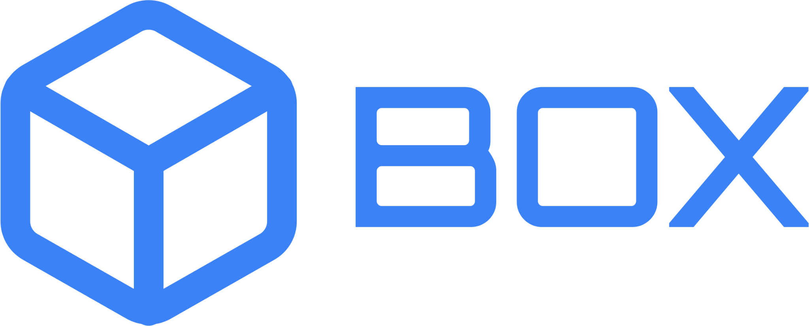
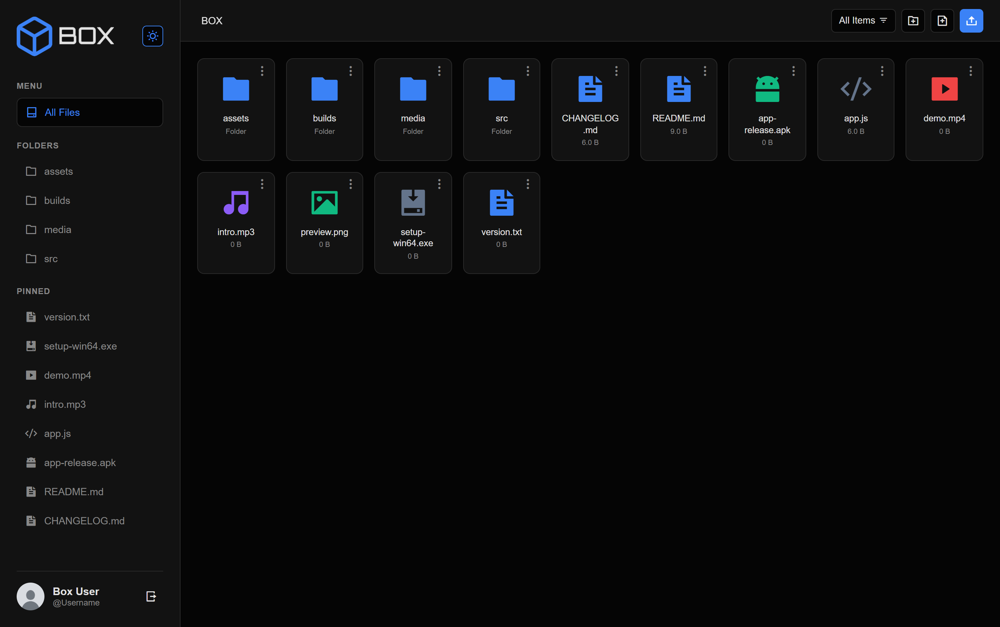

  
   
  <b>The Modern File Manager for Your GitHub Repositories.</b>
   
  <i>Browse, upload, edit, and manage GitHub files with a clean, intuitive interface. No cloning required.</i>

  
  
  
  

---

## 🖥️ Desktop UI

> *A powerful feature set designed for efficiency and ease of use.*

---

## 📌 Why Use BOX?
BOX eliminates the need for the command line when making quick changes to your GitHub repositories. Just connect your token and manage your code directly from the browser.

### ✨ Key Features
- 📂 **Intuitive File Operations:** Enjoy drag & drop uploads, easy creation of files/folders, renaming, and deletion.
- 📝 **Built-in Code Editor:** View and edit text-based files with integrated syntax highlighting.
- 🖼️ **Image & File Previews:** Instantly preview images on hover and view other files through a clean modal.
- 🌑 **Light & Dark Modes:** A carefully designed dark theme and light theme that adapts to your comfort.
- 📱 **Fully Responsive:** A seamless experience across desktop, tablets, and mobile devices.
- 📌 **Pin Frequent Items:** One-click access to your most-used files and folders via the sidebar.

---

## 🚀 Getting Started

To connect BOX to your account, you need to generate a **Personal Access Token (Classic)** from GitHub. This ensures secure access without sharing your password.

### 1. Generate Token
Go to GitHub and generate a token with the following **Scopes**:
- `repo` (Full control of private repositories)
- `repo:status` (Access commit status)
- `repo_deployment` (Access deployment status)
- `public_repo` (Access public repositories)
- `repo:invite` (Access repository invitations)
- `security_events` (Read and write security events)

### 2. Connect
Paste your token into the BOX interface to start managing your repositories instantly.

---

## 🛡️ Privacy & Data Security
Your security is our priority. 
- **Local Storage:** Personal Access Tokens are stored strictly in your browser's local storage.
- **Direct Communication:** Your token is communicated directly to GitHub's API. 
- **No Servers:** We never send your data or tokens to our servers.

---

## 🛠 Built With
* **Structure:** HTML5 (Vanilla)
* **Styling:** CSS3 (Custom properties, Responsive Design)
* **Interactivity:** Vanilla JavaScript (ES6+)
* **API:** GitHub REST API

---

## ❤️ Contributing
Help make BOX even better! We strongly encourage community contributions.

1. **Fork the Repository**: Create your own copy of the project.
2. **Create a New Branch**: Use a descriptive name (e.g., `feat/add-new-button`).
3. **Submit a Pull Request**: Once your changes are ready, submit them for review.

*Please remember to add your name to the contributors list in the documentation!*

---

## 📜 License & Usage Policy
**Copyright (c) 2026 — BOX Project**

This project is provided for **free personal and educational use**. 
- ✅ **Allowed:** Forking, modifying for personal use, and bug fixes.
- ❌ **Forbidden:** Selling, re-branding, or distributing this software and claiming it as your own work.

---

Proudly Open Source — Built for the community.

